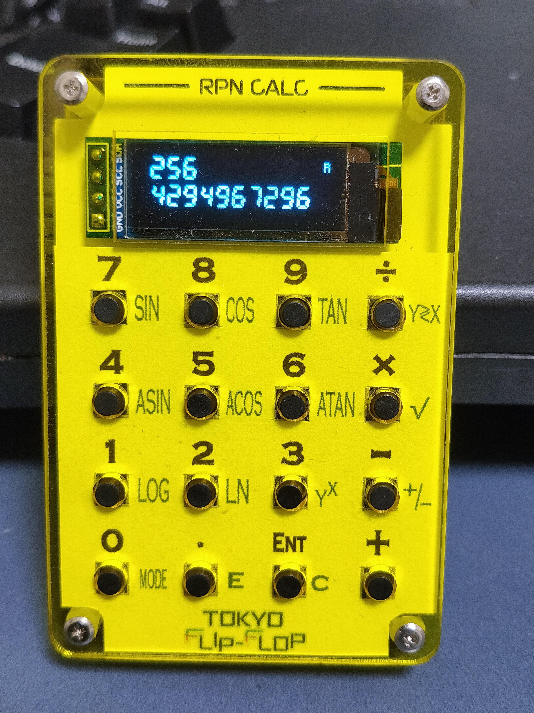

# ホビーRPN電卓 (Ypsilon project版)

TOKYO FLIP-FLOP「ホビーRPN電卓」のファームウェアを独自に改変したものです。

## ホビーRPN電卓について

Tokyo Flip-flopさんが提供している小型のRPN電卓同人ハードです。
本家サイト：https://www.hobby-rpn.com/

## ブランチ

1. mainブランチ
機能追加本流ブランチ。 テスト済みの機能だけ入っています。

3. その他ブランチ
機能開発用ブランチ。 基本動作未確認でしょう。

## Mainブランチ機能状況

** [現在Wikiページに情報を移行中](https://github.com/ypsilon-takai/hobby-rpn/wiki) ** 

Wikiの方もご覧ください。

今の見た目

アンダーレイシートについては、Wikiで。

### 関数電卓機能

**ステータス**： 済

以下の関数に対応
* 三角関数(sin, cos, tan)
* 逆三角関数(asin, acos, atan)
* 対数(log，ln)
* 累乗

三角関数の角度モードが変更できます。Degree(度)モードとRadian(ラジアン)モード。

現在のモードが別るように、ディスプレイの右上にインジケータを設けました。「R」と表示されているときはラジアンモードです。

モードの切り替えるにはMODEボタン(= 0ボタンの長押し)を使います。

### "=" 長押しで、全クリアでなくて、xのみ消去

**ステータス**： 済

入力中の内容を修正する方法が無くてクリアが全スタッククリアなのは、入力ミスしたときに痛すぎるので、xだけ消すように変更しました。

スタックを全クリアしたい場合は、0を入れてエンターを3回押しましょう。

### "-" 長押しで、符号反転

**ステータス**： 済

元の仕様は、負の数の入力ができません。

0から引くという手順を踏めば可能ですが、スタックを1つ余計に必要とするのでちょっと不便。

### "/" 長押しで、x<>y(入れ替え)

**ステータス**： 済

ちょっと複雑な計算だと、xとyの入れ替えがあると便利なんですよ。

### "*" 長押しで、平方根

**ステータス**： 済

二乗とか累乗は計算できても、開平は難しいので、入れてみました。

### ディスプレイに2行表示する。

**ステータス**： 済

OLEDも余裕があるので、HP 42sのようにx, yの2行が表示されているとよりわかりやすい。

## フォント変更

フォントはttfファイルがあれば、Adafluet GFXの変換ツールでフォントヘッダー形式に変換することができるが、アウトラインをビットマップにレンダリングしているので、ピクセルで見ると安定していない。
[フォントのエディタ](https://tchapi.github.io/Adafruit-GFX-Font-Customiser/)で整形する必要がある。

AdafluetのGFXでは、フォントの容量を圧縮できるように、一部の文字のグリフだけを持って動けるようになっている。
必要なのは、 0-9の数字、,(ドット)、+(プラス)、-(マイナス)、I,N,F,a(INFとNaN用)だけ。 (おまけで,(カンマ)も入れてある)

### Voyager風フォント

[HPミュージアムにあるVoyagerのttfフォント](https://www.hpmuseum.org/cgi-sys/cgiwrap/hpmuseum/articles.cgi?read=286)を元にビットマップを作成。

ただし、フォントの並びが普通のものと違うのか、変換ツールの問題なのか、正しく取り出せなかった。
なんとか形は抽出できたので、それをベースに先ずは"8"を作って、そこから数字のフォントを作った。
記号とアルファベットのフォントについては、7セグは無視することにした。

### Davinci(HP 42s)風フォント

愛用のHP 42sの液晶はドットマトリクスであまりかっこよくないのですが、作っ
てみました。解像度がちょうど倍くらいなので、まずは倍ドットで1つ

折角の解像度がもったいないので、テイストを残して、スムージングしたもの。

