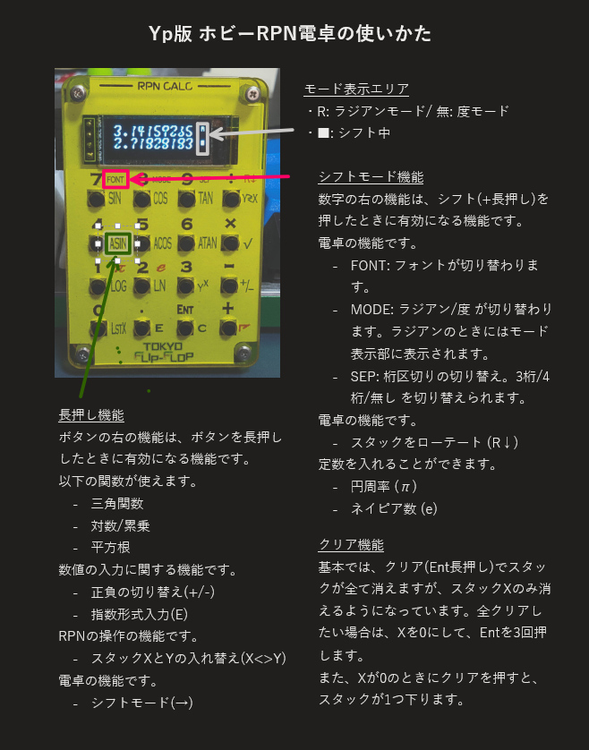

# ホビーRPN電卓 (Ypsilon project版)

TOKYO FLIP-FLOP「ホビーRPN電卓」のファームウェアを独自に改変したものです。

## ホビーRPN電卓について

Tokyo Flip-flopさんが提供している小型のRPN電卓同人ハードです。
本家サイト：https://www.hobby-rpn.com/

## ブランチ

1. mainブランチ
機能追加本流ブランチ。 テスト済みの機能だけ入っています。

3. その他ブランチ
機能開発用ブランチ。 基本動作未確認でしょう。

## Mainブランチ機能状況

** [現在Wikiページに情報を移行中](https://github.com/ypsilon-takai/hobby-rpn/wiki) ** 

Wikiの方もご覧ください。

アンダーレイシートについては、Wikiで。

---
### LastX機能を入れました。

0長押しがLastXです。

### ローテート(R↓)を入れました。

シフト÷ がローテートです。

### 定数を入れました

円周率(π) をシフト1に入れました。
ネイピア数(e) をシフト2に入れました。

---
### 提供いただいたフォントを追加しました。

twitterで機能要望などをいただいていた@連絡いただいた@WarabiMkVさんから
フォントをいただきました。ちょっとミリタリー風。

---

### 桁区切り記号を入れられるようになりました。

Shift-9 で桁区切り記号が入るようになりました。区切り無し—>3ケタ->4ケタと切り替わります。選択した状態は電源を来っても保存します。

ファーム更新後の初回起動だけ、2回押さなければなりません。

見易いようにフォントを調整しました。

### ラジアンモードのキーを変更しました。

Shift-8 に変更しました。  元は、0キー長押ししにアサインしていました。

###  フォントの変更方式を替えました。

Shift-7 でフォントを切り替えるようにしました。押すと別のフォントに切り替わります。

切り替えは容量の関係で2種類のみです。今は3種類付いているので選んで載せてください。これも、選択した状態は電源を来っても保存します。

### 0をクリアするとスタックが降りるようにしました

Xが0のときにクリアするとスタックを1段降ろすようにしました。ミスのリカバリが少し楽になります。

### Underlayシートを更新

いろいろ替えたので、更新しました。

---

### シフトキー機能

**ステータス**： 済

"+" 長押しでシフトに入ります。
シフトでの機能は数字の右側に表示することにします。
シフト中は画面の右端に黒抜きのシフトマークが表示されます。

### フォントの更新

**ステータス**： 途中

シフト+7 シフト+8 シフト+9 でフォントが変更できます。
ほんとは 7で順に変わるようにしたい。

また、EEPROMでフォントの状態を記憶しておくようにした。

### 関数電卓機能

**ステータス**： 済

以下の関数に対応
* 三角関数(sin, cos, tan)
* 逆三角関数(asin, acos, atan)
* 対数(log，ln)
* 累乗

三角関数の角度モードが変更できます。Degree(度)モードとRadian(ラジアン)モード。

現在のモードが別るように、ディスプレイの右上にインジケータを設けました。「R」と表示されているときはラジアンモードです。

モードの切り替えるにはMODEボタン(= 0ボタンの長押し)を使います。

### "=" 長押しで、全クリアでなくて、xのみ消去

**ステータス**： 済

入力中の内容を修正する方法が無くてクリアが全スタッククリアなのは、入力ミスしたときに痛すぎるので、xだけ消すように変更しました。

スタックを全クリアしたい場合は、0を入れてエンターを3回押しましょう。

### "-" 長押しで、符号反転

**ステータス**： 済

元の仕様は、負の数の入力ができません。

0から引くという手順を踏めば可能ですが、スタックを1つ余計に必要とするのでちょっと不便。

### "/" 長押しで、x<>y(入れ替え)

**ステータス**： 済

ちょっと複雑な計算だと、xとyの入れ替えがあると便利なんですよ。

### "*" 長押しで、平方根

**ステータス**： 済

二乗とか累乗は計算できても、開平は難しいので、入れてみました。

### ディスプレイに2行表示する。

**ステータス**： 済

OLEDも余裕があるので、HP 42sのようにx, yの2行が表示されているとよりわかりやすい。

## フォント一覧

[フォントのエディタ](https://tchapi.github.io/Adafruit-GFX-Font-Customiser/) でポチポチ作っています。

ただし、AdafluetのGFXでは、フォントの容量をできるように、一部の文字のグリフだけを持って動けるようになっている。
必要なのは、 0-9の数字、,(ドット)、+(プラス)、-(マイナス)、I,N,F,a(INFとNaN用)だけ。 (おまけで,(カンマ)も入れてある)

### sidonia 14x9 

@WarabiMkV(twitter)さんからいただいたフォントです。

### 蛍光表示管 DC10B 風フォント

Twitterで流れてきた蛍光表示管 DC10B の書体を真似たものです。

### Voyager風フォント

[HPミュージアムにあるVoyagerのttfフォント](https://www.hpmuseum.org/cgi-sys/cgiwrap/hpmuseum/articles.cgi?read=286)を元にビットマップを作成。

記号とアルファベットのフォントについては、7セグは無視することにした。

### Davinci(HP 42s)風フォント

愛用のHP 42sの液晶はドットマトリクスであまりかっこよくないのですが、作っ
てみました。解像度がちょうど倍くらいなので、まずは倍ドットで1つ

折角の解像度がもったいないので、テイストを残して、スムージングしたもの。

